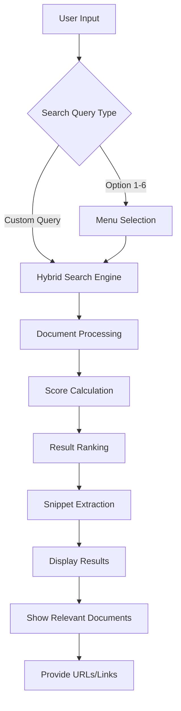

# Medical Documentation Hybrid Search System

A Python-based hybrid search system designed to search anything through medical device documentation and manuals.

## Overview

This system provides an intelligent search interface for medical documentation, combining multiple search methodologies to deliver relevant results from technical manuals and device documentation.

## Features

- **Hybrid Search Capabilities**: Combines multiple search algorithms for better accuracy
- **Medical Document Focus**: Specialized for medical device manuals and technical documentation  
- **Interactive Search Interface**: User-friendly command-line interface with search options
- **Document Scoring**: Results ranked by relevance score
- **Multi-format Support**: Handles PDF documents and extracts relevant content
- **Snippet Extraction**: Shows relevant excerpts from matched documents

## System Architecture


## Project Structure
```
medical-doc-search-system/
├── src/
│   ├── __init__.py
│   ├── config/
│   │   ├── __init__.py
│   │   └── settings.py
│   ├── core/
│   │   ├── __init__.py
│   │   ├── azure_clients.py
│   │   ├── document_processor.py
│   │   └── embedding_generator.py
│   ├── search/
│   │   ├── __init__.py
│   │   ├── index_manager.py
│   │   └── interactive_search.py
│   └── utils/
│       ├── __init__.py
│       ├── file_utils.py
│       └── logger.py
├── main.py
├── .env
├── requirements.txt
└── README.md
```

## Setup
1. Clone the repo and install dependencies:
   ```bash
   pip install -r requirements.txt
   ```
2. Create a `.env` file with your Azure and OpenAI credentials:
   ```env
   AZURE_SEARCH_ENDPOINT=...
   AZURE_SEARCH_API_KEY=...
   DOC_INTELLIGENCE_ENDPOINT=...
   DOC_INTELLIGENCE_KEY=...
   OPENAI_API_ENDPOINT=...
   OPENAI_API_KEY=...
   ```
3. Run the pipeline:
   ```bash
   python main.py
   ```

The system will present you with options:
- Choose numbered options (1-6) for predefined searches
- Enter custom search queries for hybrid search

### Example Search

As shown in the screenshot above, searching for "monitoring system setup" returns relevant results from medical device manuals including:

- **Patient Monitor Technical Manual (PM-500)**: ECG monitoring, blood pressure monitoring, pulse oximetry, temperature monitoring, and respiratory rate detection
- **Anesthesia System Manual (AS-2000)**: Setup instructions and safety precautions

## Key Components

### Hybrid Search Engine
- **Multi-parameter search**: Combines different search strategies
- **Relevance scoring**: Documents ranked by relevance (0.0-1.0 scale)
- **Content extraction**: Pulls relevant snippets from matched documents

### Document Processing
- **PDF parsing**: Extracts text content from PDF manuals
- **Metadata extraction**: Identifies document type and relevant sections
- **Content indexing**: [Inference] Likely creates searchable indexes for faster retrieval

### Results Display
- **Scored results**: Each result includes a relevance score
- **Relevant snippets**: Shows key excerpts that match the search query
- **Source links**: Provides URLs or file paths to original documents

## Search Categories

1. **Device Overview**: General information about medical devices
2. **Setup Instructions**: Installation and configuration guides  
3. **Safety Precautions**: Safety protocols and warnings
4. **Technical Specifications**: Device parameters and capabilities
5. **Maintenance**: Daily checks and maintenance procedures
6. **Troubleshooting**: Problem resolution guides

## Technology Stack

**Core Technologies:**
- **Python**: Core programming language
- **CLI interface**: Command-line user interaction
- **Azure Cloud Services**: Document search and AI capabilities

**Azure SDK Dependencies:**
- **azure-search-documents (≥11.4.0)**: For Azure Cognitive Search functionality
- **azure-ai-formrecognizer (≥3.3.0)**: For document analysis and content extraction
- **azure-core (≥1.29.0)**: Core Azure SDK functionality

**AI/ML Integration:**
- **openai (≥1.12.0)**: OpenAI API integration for enhanced search capabilities

**Core Dependencies:**
- **python-dotenv (≥1.0.0)**: Environment variable management
- **requests (≥2.31.0)**: HTTP requests and API communication
- **typing-extensions (≥4.8.0)**: Enhanced type hints support

**Development & Monitoring:**
- **structlog (≥23.2.0)**: Advanced structured logging and monitoring

**Search Implementation:**
- **Hybrid search algorithms**: Combining Azure Cognitive Search with AI-powered relevance
- **Document processing**: Azure Form Recognizer for PDF parsing and content extraction
- **Relevance scoring**: OpenAI integration for semantic search capabilities

## Contributing

1. Fork the repository
2. Create a feature branch
3. Make your changes
4. Add tests for new functionality
5. Submit a pull request

## License

[MIT License](LICENSE)